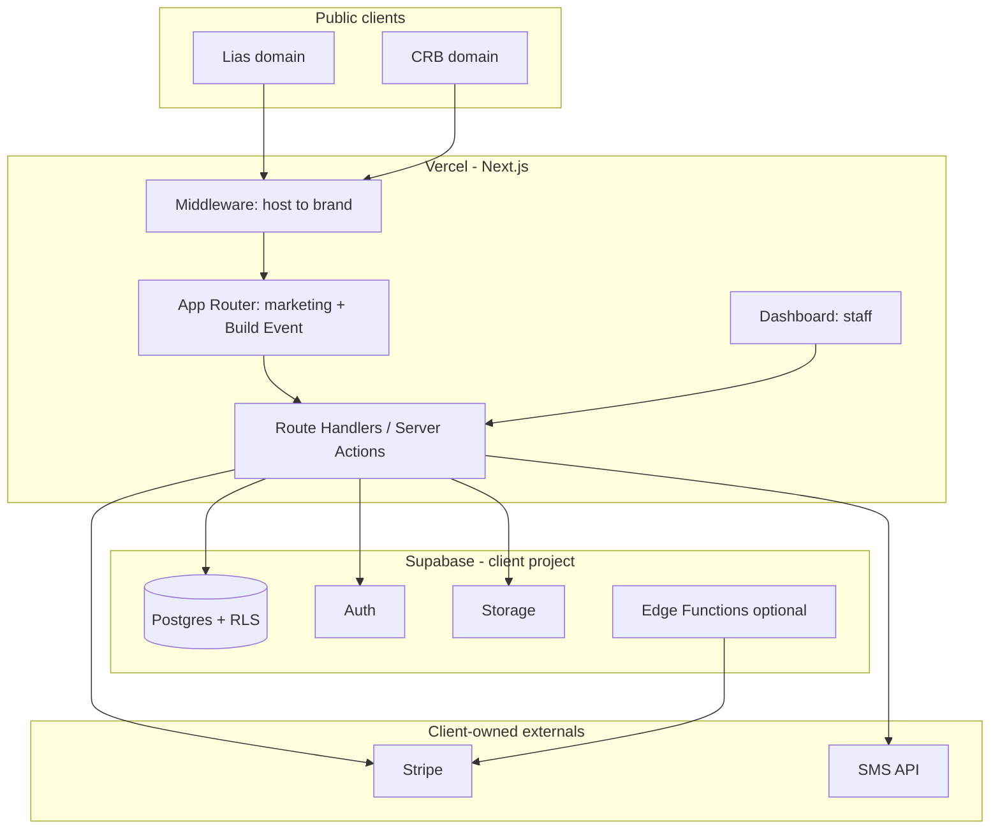

# Party Rental Platform — Architecture & Implementation Plan

**Status:** Planning (no implementation yet)  
**Brands:** Lias Party Rentals, CRB Jumpers  
**Stack:** Next.js (Vercel), Supabase (Postgres, Auth, Storage, Edge Functions)  
**Principle:** One client-owned backend; two distinct customer experiences; one source of truth for inventory and reservations.

---

## 1. Recommended system architecture

### High-level

- **Single Next.js application** deployed on the client’s Vercel project. It serves both public marketing/booking sites and the authenticated operations dashboard.
- **Supabase** (client-owned project) provides: Postgres, Row Level Security (RLS), Auth (customers + staff), Storage (product photos, signed PDFs), optional Edge Functions for webhooks and sensitive server logic.
- **Brand resolution** happens at the edge of the app (middleware): map hostname → `brand_id` (and optional locale). All customer-facing queries are scoped by brand for *presentation* (copy, theme, SEO) while **inventory and availability are global** to the business.
- **External services** (all under client accounts): Stripe (cards), SMS provider (e.g. Twilio or similar), email (Resend/Postmark optional), PDF generation (server-side or Supabase function).

### Why not separate backends

A shared Postgres with clear schemas and RLS avoids sync bugs, duplicate booking logic, and operational drift. The risk of “two codebases diverging” is higher than the cost of theming one app well.

### Diagram (logical)



---

## 2. Database entities / schema proposal

Naming is illustrative; adjust to your migration style. Use **UUIDs**, `timestamptz`, and soft deletes only where audit needs justify it.

### Core tenancy & brands

| Table | Purpose |
|--------|---------|
| `business` | Single row (or few) representing the operating entity; tax, legal name, default service area (e.g. Moreno Valley). |
| `brand` | One row per customer-facing brand: `slug`, `name`, `primary_domain`, `theme_tokens` (JSON), `logo_path`, `seo_defaults`, `support_phone`, `zelle_display_*`. |
| `brand_domain` | Optional many domains per brand for redirects and future domains. |
| `user_profile` | Links Supabase `auth.users` to `role` (`owner`, `operator`, `readonly`), `display_name`. |
| `staff_brand_access` | If some staff should only see one brand in UI reporting (optional); operations data remains shared. |

### Catalog & inventory (shared)

| Table | Purpose |
|--------|---------|
| `product_category` | Tents, jumpers, tables, add-ons, etc. |
| `product` | Name, description, `brand_marketing_copy` override JSON if needed per brand, base pricing region, active flag. |
| `product_image` | Storage paths, sort order, alt text. |
| `product_spec` | Structured specs: jumper size, **required setup footprint** (length/width), weight, stakes vs sandbags, power needs. |
| `sku` or `product_variant` | Rentable SKU (e.g. “Castle Jumper — 13×13”). Ties to specs and price. |
| `inventory_unit` | Optional: track individual physical units (serial/barcode). For many jumpers, **one row per physical asset** with `sku_id`. |
| `bundle` / `bundle_item` | Optional cross-sell definitions (jumper + tables package). |
| `price_rule` | Region-based pricing (Moreno Valley baseline), weekend/holiday multipliers, min deposit %, non-refundable deposit flag. |

### Availability & bookings (single pool)

| Table | Purpose |
|--------|---------|
| `availability_block` | Maintenance, blackout dates, or manual holds per `inventory_unit` or `sku`. |
| `quote` | Anonymous or logged-in; `brand_id` for attribution; expires at; JSON snapshot of selections. |
| `reservation` | The commercial record: customer, event date(s), service address, status (`draft`, `pending_payment`, `confirmed`, `cancelled`, `completed`), `brand_id` (which site converted), totals, deposit policy version. |
| `reservation_line` | `sku_id`, qty, start/end datetime (for multi-day), line price, linked `inventory_unit_id`(s) when assigned. |
| `reservation_intake` | Normalized answers: surface type, dogs, gate width confirmation, placement notes, space dimensions customer attests. |
| `assignment` | Maps `reservation_line` → `inventory_unit_id` for the booked window (enforces one physical unit at one time). |

### CRM & communications

| Table | Purpose |
|--------|---------|
| `contact` | Person: name, phones, emails, tags, `preferred_brand_id` optional. |
| `lead` | Inbound inquiry; source (`web_form`, `phone`, `sms`), stage, owner staff, linked `contact`. |
| `activity` | Calls, notes, SMS sent, emails (metadata). |
| `conversation` / `message` | Optional threading for SMS history. |
| `automation_rule` | Trigger definitions (see SMS section). |
| `automation_run` | Idempotency and delivery logs. |

### Legal & payments

| Table | Purpose |
|--------|---------|
| `terms_version` | HTML/markdown content, effective date, deposit and weather policy text. |
| `acceptance` | `reservation_id`, `terms_version_id`, IP, user agent, timestamp, **typed name** and/or click-wrap hash; link to stored PDF if generated. |
| `payment` | `method` (`zelle_pending`, `zelle_confirmed`, `stripe`), amount, currency, Stripe IDs, `confirmed_by_user_id` for Zelle, `proof_image_path` optional. |
| `refund_policy_exception` | Rare overrides; audit only. |

### Indexes & constraints (critical)

- **Unique physical availability:** partial unique index on `(inventory_unit_id, tstzrange)` or enforce via application transaction + `SELECT … FOR UPDATE` on units for the date range. Postgres exclusion constraints (`btree_gist`) are ideal if you model bookings as ranges.
- **`reservation` + `reservation_line`:** foreign keys with `ON DELETE RESTRICT` where money is involved.
- **Search:** GIN on `tsvector` for product search if needed; GiST for geographic later.

---

## 3. Suggested multi-brand structure

### Data model

- **`brand_id` on `quote` and `reservation`** records which site drove the conversion (analytics, commissions, future brand-specific pricing).
- **Catalog is shared.** If a product should be hidden on one brand, use `product_brand_visibility` (`product_id`, `brand_id`, `visible`) rather than duplicating products.
- **Themes:** CSS variables or Tailwind theme extensions loaded per request based on `brand` row (colors, fonts, radius, imagery).

### Routing

- **Production:** each brand on its **own apex domain** (recommended for SEO and trust). Middleware sets `brand` from hostname.
- **Preview/staging:** `lias.preview.example.com` / `crb.preview.example.com` or path-based only in dev if you accept SEO/noise tradeoffs locally.

### Content

- **Shared components, swapped slots:** hero, testimonials, and gallery differ per brand via CMS-like JSON in `brand` or a small `page_block` table if you outgrow JSON.

---

## 4. Booking / inventory synchronization logic

### Rules

1. **Availability is global:** allocating `inventory_unit` U1 on June 7 for Brand A makes U1 unavailable for Brand B for overlapping times.
2. **Quote is soft hold:** optional short TTL (e.g. 15–30 min) using `quote` + server clock; do not permanently block inventory until deposit path starts.
3. **Confirm path:** on “pay deposit” or “confirm reservation,” run a **transaction:**
   - Re-check overlaps for each required `inventory_unit` or SKU capacity.
   - Insert `reservation` + lines + assignments.
   - If any check fails → user sees “no longer available” and offered alternatives (other SKU/date).

### Concurrency

- Use **database-level locking or exclusion constraints**; do not rely only on UI checks.
- For SKU-level quantity without per-unit tracking: maintain `sku_available_count` only with careful transactional updates, or count overlapping reservations in a single query inside the transaction.

### Partial fulfillment

- If multiple jumpers in one cart, failure should be **all-or-nothing** for the event date unless you explicitly support partial bookings (usually worse UX).

---

## 5. Recommended CRM modules

| Module | Scope |
|--------|--------|
| **Lead inbox** | Web form submissions, missed calls (manual), SMS opt-in leads. |
| **Pipeline** | Stages: New → Qualified → Quote sent → Booked → Lost. |
| **Contact 360** | All reservations, messages, notes, files. |
| **Tasks / follow-ups** | Snooze, assign to operator, due dates. |
| **Segments & tags** | e.g. “repeat customer,” “corporate,” “school.” |
| **Automation hooks** | Event-driven (see SMS). |
| **Reporting** | Conversion by brand, SKU popularity, no-show risk, revenue by period. |

Keep CRM **inside the dashboard** first; avoid a separate CRM tool until scale demands it (reduces cost and sync issues).

---

## 6. Payments architecture (Zelle-first, Stripe-secondary)

### Reality check

- **Zelle** has no merchant API for programmatic confirmation. “Zelle-first” means a **guided customer experience + operator verification workflow**, not fully automated payment clearing.

### Recommended flow

1. **At checkout:** show total, deposit amount, and **Zelle instructions** (phone/email + exact amount + memo format e.g. `RES-XXXX`).
2. **Customer marks “I sent Zelle”** → `payment` row `zelle_pending`, optional upload screenshot.
3. **Dashboard queue:** operators confirm bank receipt → `zelle_confirmed` → reservation moves to `confirmed` (or `pending` if you need contract step first—order steps in section 7).
4. **Stripe path:** PaymentIntent for deposit or full amount; webhooks update `payment` and reservation status.

### Accounting hygiene

- Store **intended brand** on `payment` for payout reconciliation if bank accounts differ later.
- Never store full card numbers; Stripe only.

### Deposits & policies

- Encode **non-refundable except weather** in `terms_version` and surface again at payment. Actual refund execution stays manual or Stripe-linked in dashboard with reason codes.

---

## 7. Digital contract / signature flow

### Practical tier (fast to ship, legally discuss with attorney)

1. Present **scrollable terms** with explicit checkboxes: access width ≥ 3.5 ft, surface type acknowledged, dogs disclosure, setup space sufficient for selected SKU dimensions.
2. Collect **typed full name** + “I agree” + timestamp + IP/UA stored in `acceptance`.
3. Generate **PDF snapshot** (terms + intake answers + reservation summary) to Storage; link from `acceptance`.

### Optional upgrade

- Integrate e-sign provider (Dropbox Sign / SignWell) if counsel wants stronger evidence—adds cost and complexity.

### Ordering relative to payment

**Opinion:** **Intake + terms acceptance before payment** reduces chargebacks and support mess. If you need speed, allow parallel “terms accepted” + “payment pending” but gate **confirmed** on both.

---

## 8. SMS automation architecture

### Provider

- Twilio (or equivalent) under **client billing**. Register **A2P / 10DLC** brand and campaigns early—approval latency is a real schedule risk.

### Data

- Store **opt-in** per channel with timestamp and keyword (TCPA-sensitive). Separate transactional vs marketing.

### Event triggers (examples)

| Event | SMS idea |
|--------|----------|
| Quote abandoned (30–60 min) | “Still interested? Reply HELP.” |
| Zelle pending reminder | Payment instructions repeat + link to status page. |
| Confirmed | Date, address summary, prep checklist. |
| 24h before delivery | Access/dogs reminder. |
| Post-event | Review link (one brand domain). |

### Implementation

- **Queue table** (`outbound_message`) + worker (Edge Function cron or Vercel cron hitting a secured route) for retries.
- **Templates** per `brand_id` with variable substitution.
- Log **delivery status** webhooks back to `message` rows.

---

## 9. SEO architecture for both sites

### Technical

- **Separate sitemaps** per hostname (`sitemap.xml` generated from hostname).
- **`robots.txt`** per brand if needed.
- **Canonical URLs** always on the brand’s domain.
- **Structured data:** `LocalBusiness`, `Product` where appropriate, `FAQPage` on service pages.
- **Core Web Vitals:** image optimization, font strategy, avoid layout shift in configurators.

### Content

- **Unique copy per brand** on homepage, about, and locality pages (Moreno Valley + nearby cities cautiously—avoid doorway-page patterns; genuine localized content wins).
- **Product URLs** can be shared paths (`/jumpers/...`) with brand-specific intros via server components reading `brand`.

### Analytics

- Separate GA4 properties or one property with brand dimension—decide early for reporting clarity.

---

## 10. Admin / dashboard module map

| Area | Capabilities |
|------|----------------|
| **Today** | Deliveries/pickups, assignments, driver notes. |
| **Reservations** | Search, edit (with audit), status changes, PDF links. |
| **Inventory** | Units, maintenance blocks, SKU setup. |
| **Catalog** | Products, images (Storage upload), specs, visibility by brand. |
| **Pricing** | Regional rules, weekends, deposits. |
| **CRM** | Leads, contacts, activities. |
| **Payments** | Zelle confirmation queue, Stripe refunds (limited roles). |
| **SMS** | Templates, logs, opt-outs. |
| **Settings** | Brands/domains, terms versions, staff users, integrations. |
| **Reports** | Utilization, revenue, brand comparison. |

**Mobile-first:** prioritize **Today**, **Zelle queue**, **reservation detail**, **SMS log** for small screens.

---

## 11. Recommended phased implementation plan

### Phase 0 — Client-owned foundations (week 1)

- Create GitHub repo, Vercel project, Supabase project; document env vars; DNS plan for both domains.

### Phase 1 — Skeleton & brands (1–2 weeks)

- Next.js App Router, middleware hostname → brand, themed layouts, basic marketing pages, Supabase Auth for staff.

### Phase 2 — Catalog + SEO baseline (1–2 weeks)

- Schema, RLS policies, product listing/detail, Storage images, structured data, sitemap per host.

### Phase 3 — Build Your Event MVP (2–4 weeks)

- Configurator: product → date → availability → intake questions → add-ons → quote/reservation draft.

### Phase 4 — Payments (1–2 weeks)

- Stripe deposit; Zelle pending/confirm flow; customer reservation status page.

### Phase 5 — Contracts & PDF (1 week)

- Terms versioning, acceptance logging, PDF snapshot.

### Phase 6 — CRM + SMS (2–3 weeks)

- Leads, activities, templates, outbound queue, key automations; 10DLC registration in parallel as early as possible.

### Phase 7 — Operations hardening (ongoing)

- Assignment UI, calendar views, notifications, reporting, brutal visual redesign pass with real content.

Phases overlap with design/content production; **10DLC and legal copy** should start early due to external latency.

---

## 12. Risks, edge cases, dependencies

| Risk | Mitigation |
|------|------------|
| **Double booking race** | DB transactions + exclusion constraint or `FOR UPDATE`; load test the confirm path. |
| **Zelle ambiguity** | Strict memo format; amount uniqueness; manual queue; SLA for confirmation. |
| **Weather refunds** | Defined policy in terms; manual refund with reason; future: weather data integration is optional complexity. |
| **SMS compliance** | Opt-in, quiet hours, STOP handling; counsel review for templates. |
| **Brand drift in UX** | Shared design system with tokens; periodic QA on both domains. |
| **Supabase RLS mistakes** | Security review per table; integration tests for cross-brand data access. |
| **Large dogs / liability** | Intake captures disclosure; not a substitute for insurance/legal advice. |
| **Multi-day / overnight rentals** | Define `tstzrange` rules upfront (delivery day vs event day). |
| **DST / timezone** | Store times in `timestamptz`; display in America/Los_Angeles. |

---

## 13. What we still need from the client

- Legal business name(s), EIN, banking destinations for Zelle (and whether one or two accounts by brand).
- **Insurance / liability** language for terms (attorney).
- Exact **pricing tables** (Moreno Valley), deposit %, weekend/holiday rules, weather exception definition.
- **SKU list** with real dimensions/setup footprint and photos.
- **Physical inventory count** per SKU (and whether units are interchangeable).
- **Service area** ZIP/radius and delivery fees if any.
- **SMS** use cases requiring marketing vs transactional classification.
- Domain registrar access and desired **apex domains** for each brand.
- Whether **CRM** should import existing customer spreadsheet on day one.

---

## 14. Recommended folder structure (Next.js monorepo-style)

Opinionated **single app** layout:

```text
src/
  app/
    (marketing)/           # Shared route group; brand from context
      page.tsx
      jumpers/[slug]/page.tsx
    (checkout)/
      build/page.tsx       # Build Your Event
      ...
    (dashboard)/
      layout.tsx           # Staff auth guard
      today/page.tsx
      reservations/...
    api/
      webhooks/stripe/route.ts
  middleware.ts
  lib/
    supabase/
      server.ts
      client.ts
    brand/
      resolve.ts
      themes.ts
    booking/
      availability.ts
      pricing.ts
    crm/
    sms/
  components/
    ui/                    # Shared primitives
    brand/                 # Brand-specific wrappers
    marketing/
    dashboard/
  styles/
  types/
supabase/
  migrations/
  seed.sql
public/
```

Add `packages/` later **only** if you split admin CLI or shared types for mobile app—don’t start there.

---

## 15. One Next.js app vs two frontends

### Recommendation: **one Next.js app** with **brand-aware routing** and **separate domains**

**Pros:** single booking engine, one deploy, one Supabase RLS model, faster fixes, shared configurador, true inventory sync by construction.

**Cons:** discipline required to avoid leaking brand A assets into brand B (mitigate with tests + `brand` context); slightly more complex middleware.

### When two frontends would make sense

- Different teams with **independent release cycles** and **no shared components**, or radically different product strategy. You’d still use **one API/Supabase**; cost is duplicated UI work and drift.

For this business, **one app is the right default.**

---

## Summary opinion

Build **one client-owned Supabase project** and **one Next.js app** on **client Vercel**, with **hostname-based branding**, **shared inventory with hard database guarantees on overlap**, **Zelle as an operator-confirmed rail plus Stripe for cards**, and **SMS as an event-driven queue** with compliance baked in. Ship **Build Your Event** early, then payments, then CRM/SMS, while **SEO and structured data** ride alongside from Phase 2 so you do not retrofit URLs and metadata later.

When you are ready to leave planning, the first implementation milestone should be: **domains → middleware → Supabase schema for `brand`, `product`, `inventory_unit`, `reservation` skeleton → read-only catalog on both sites.**
